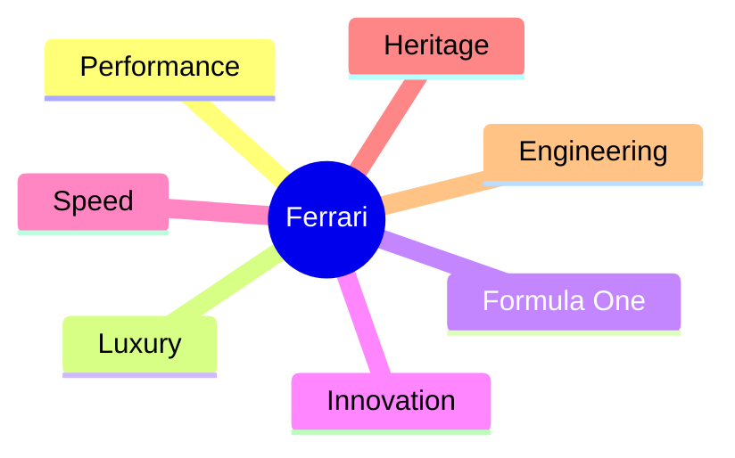

<!-- ========================================================= -->
<!--                  FERRARI SHOWCASE README                  -->
<!--          A Premium Markdown Demonstration Project         -->
<!-- ========================================================= -->

<div align="center">

# 🏎️ FERRARI OF LUSANDA
### *Engineering Passion Since 1947*


<br>


---

## *"Ferrari isn't simply a car. It is a statement of engineering, speed, elegance, and timeless passion."*

</div>

---

# 📖 Table of Contents

- [Introduction](#-introduction)
- [The Ferrari Philosophy](#-the-ferrari-philosophy)
- [Gallery](#-gallery)
- [Legendary Models](#-legendary-models)
- [Specifications](#-specifications)
- [Performance Metrics](#-performance-metrics)
- [Technology](#-technology)
- [Interior](#-interior)
- [Why Ferrari?](#-why-ferrari)
- [Ferrari Timeline](#-ferrari-timeline)
- [Formula 1 Legacy](#-formula-1-legacy)
- [Interesting Facts](#-interesting-facts)
- [Comparison Table](#-comparison-table)
- [Quote](#-quote)
- [Credits](#-credits)

---

# 🚀 Introduction

Ferrari represents the highest level of automotive engineering. Every vehicle embodies decades of racing heritage, Italian craftsmanship, and relentless innovation.

Designed for enthusiasts and collectors alike, Ferrari blends breathtaking aesthetics with uncompromising performance.

---

# ❤️ The Ferrari Philosophy

> **Performance without compromise.**

Ferrari believes that driving should be emotional.

Every curve...
Every exhaust note...
Every gear shift...
Every heartbeat...

...should remind the driver why Ferrari has become one of the most admired automotive manufacturers in history.

---

# 📸 Gallery

<div align="center">

| Front View | Side View |
|------------|-----------|
|  |  |

| Rear View | Cockpit |
|------------|-----------|
|  |  |

</div>

---

# 🏆 Legendary Models

| Model | Engine | Horsepower | Top Speed |
|--------|---------|------------|------------|
| Ferrari F40 | Twin Turbo V8 | 471 HP | 324 km/h |
| Ferrari Enzo | V12 | 651 HP | 355 km/h |
| Ferrari LaFerrari | Hybrid V12 | 950 HP | 352 km/h |
| Ferrari SF90 Stradale | Hybrid Twin Turbo V8 | 986 HP | 340 km/h |
| Ferrari 812 Superfast | V12 | 789 HP | 340 km/h |

---

# ⚙️ Specifications

```text
Manufacturer : Ferrari S.p.A.
Country      : Italy 🇮🇹
Founded      : 1947
Founder      : Enzo Ferrari
Industry     : Luxury Automotive
Headquarters : Maranello, Italy
```

---

# 📈 Performance Metrics

```
Acceleration
0-100 km/h
█████████████████████ 2.5 sec

Top Speed
█████████████████████████████ 340+ km/h

Braking
████████████████████████ 100%

Handling
██████████████████████████ 100%

Luxury
████████████████████████████ 100%
```

---

# 💻 Technology

Ferrari combines cutting-edge technologies including:

- Carbon Fibre Chassis
- Active Aerodynamics
- Hybrid Electric Systems
- Formula 1 Inspired Steering Wheel
- Magnetic Suspension
- Carbon Ceramic Brakes
- Electronic Differential
- Adaptive Stability Control

---

# 🛋️ Interior

```
┌─────────────────────────────────────────┐
│                                         │
│        Digital Driver Display           │
│                                         │
│      Formula One Steering Wheel         │
│                                         │
│     Premium Leather Racing Seats        │
│                                         │
│      Carbon Fibre Dashboard Trim        │
│                                         │
└─────────────────────────────────────────┘
```

---

# ⭐ Why Ferrari?

- 🚀 Incredible acceleration
- ❤️ Emotional driving experience
- 🇮🇹 Italian craftsmanship
- 🏁 Formula One DNA
- 🎯 Precision engineering
- 🏆 Racing heritage
- 💎 Exceptional resale value
- 🔥 Aggressive styling
- 🎵 Legendary engine sound
- 🌍 Global prestige

---

# 📅 Ferrari Timeline

| Year | Milestone |
|------|------------|
| 1947 | First Ferrari produced |
| 1950 | Entered Formula One |
| 1987 | Ferrari F40 released |
| 2002 | Ferrari Enzo launched |
| 2013 | LaFerrari introduced |
| 2019 | SF90 Stradale unveiled |

---

# 🏎️ Formula 1 Legacy

Ferrari remains the most successful Formula One constructor in history.

Achievements include:

- 🏆 Multiple Constructors' Championships
- 🥇 Hundreds of Grand Prix victories
- 🏁 Legendary drivers
- 🔥 Decades of innovation
- ⚡ Continuous racing excellence

---

# 📊 Comparison Table

| Feature | Ferrari | Typical Sports Car |
|-----------|---------|--------------------|
| Heritage | ⭐⭐⭐⭐⭐ | ⭐⭐⭐ |
| Design | ⭐⭐⭐⭐⭐ | ⭐⭐⭐⭐ |
| Speed | ⭐⭐⭐⭐⭐ | ⭐⭐⭐⭐ |
| Exclusivity | ⭐⭐⭐⭐⭐ | ⭐⭐ |
| Technology | ⭐⭐⭐⭐⭐ | ⭐⭐⭐⭐ |
| Prestige | ⭐⭐⭐⭐⭐ | ⭐⭐⭐ |

---

# 🎯 Interesting Facts

<details>

<summary>🏎️ Click to Expand</summary>

### Ferrari Red

The iconic Ferrari Red is known as **Rosso Corsa**.

---

### Formula One

Ferrari has competed in every Formula One World Championship since the series began.

---

### Handmade

Many Ferrari components are handcrafted by skilled Italian artisans.

---

### Exclusive Production

Ferrari intentionally limits production to preserve exclusivity.

</details>

---

# 💡 Fun Statistics

| Metric | Value |
|----------|--------|
| ❤️ Passion | 100% |
| ⚡ Performance | 100% |
| 💎 Luxury | 100% |
| 🏁 Racing DNA | 100% |
| 🎨 Design | Timeless |
| 🔥 Engine Sound | Legendary |

---

# 🌍 Worldwide Recognition



---

# 📚 Quote

> *"A Ferrari is not purchased merely for transportation; it is acquired to experience perfection in motion."*

---

# 🎨 Design Principles

- Minimalism
- Elegance
- Precision
- Passion
- Innovation
- Performance
- Exclusivity

---

# 📦 Repository Structure

```text
Ferrari/
│
├── README.md
├── images/
│   ├── ferrari-front.jpg
│   ├── ferrari-side.jpg
│   └── cockpit.jpg
│
├── assets/
│   └── logo.png
│
└── docs/
    └── specifications.pdf
```

---

# ❤️ Support

If you enjoyed this showcase,

⭐ Star the repository.

🚗 Share it with fellow automotive enthusiasts.

❤️ Appreciate the beauty of Italian engineering.

---

<div align="center">

# 🐎

# Ferrari

### *Performance • Luxury • Passion*

---

## ⭐⭐⭐⭐⭐

### **Crafted for Legends**

*"The Prancing Horse never stands still."*

---

Made with ❤️ using Markdown

</div>
